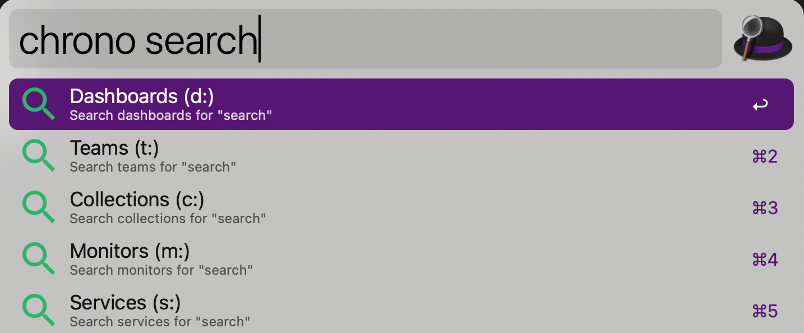

# Chronosphere for Alfred [[Download Workflow](https://github.com/jklewa/chronosphere-alfred/releases/latest)]


*Feedback or issue? [File an issue](https://github.com/jklewa/chronosphere-alfred/issues)*

**Search Collections, Services, Dashboards, Monitors & Teams**

[Chronosphere](https://chronosphere.io/) is a cloud native observability platform that provides deep insights into every layer of your stack. Chronosphere for Alfred lets you to quickly navigate Dashboards and Monitors from your [Alfred](https://alfredapp.com/) application launcher.


## Install

In order to use this Workflow you must have [Alfred](https://alfredapp.com/) and the [Alfred Powerpack](https://alfredapp.com/powerpack/).

To install Chronosphere for Alfred, [download the latest .alfredworklow](https://github.com/jklewa/chronosphere-alfred/releases/latest) open the workflow file and configure with "Configure Workflow".

### Configure
* Trigger Keyword: `chrono`
* Chronosphere Domain: `https://custom.chronosphere.io`
* Personal Access Token: See https://docs.chronosphere.io/administer/accounts-teams/personal-access-tokens

## Usage
```
chrono <search_term> - Search all resources

chrono c: <search_term> - Search Collections
chrono s: <search_term> - Search Services
chrono d: <search_term> - Search Dashboards
chrono m: <search_term> - Search Monitors
chrono t: <search_term> - Search Teams
```

### Selecting a result will open the resource in your default browser


